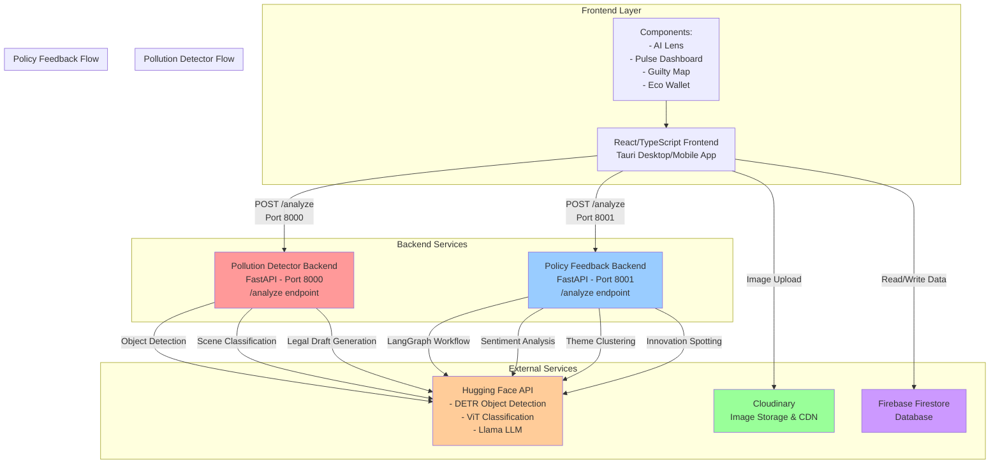

# PolluFight System Design

## Architecture Overview

This document provides a visual representation of the current system architecture and recommendations for backend consolidation.

## Current System Architecture



## Backend Services Breakdown

### 1. **Pollution Detector Backend** (Port 8000)
- **Technology**: FastAPI (Python)
- **Location**: `sub_modules/pollution_detector/main.py`
- **Purpose**: 
  - Image-based pollution detection
  - Object detection using DETR model
  - Scene classification using ViT model
  - Legal draft generation
- **Endpoints**:
  - `POST /analyze` - Analyzes uploaded images
  - `GET /` - Serves static HTML
  - `GET /health` - Health check
- **Dependencies**: 
  - Hugging Face API (DETR, ViT)
  - PIL for image processing
  - FastAPI, uvicorn

### 2. **Policy Feedback Backend** (Port 8001)
- **Technology**: FastAPI (Python) with LangGraph
- **Location**: `sub_modules/policy_feedback/backend/main.py`
- **Purpose**:
  - Community comment analysis
  - Sentiment analysis
  - Theme clustering
  - Innovation spotting
- **Endpoints**:
  - `POST /analyze` - Analyzes comments array
  - `GET /health` - Health check
- **Dependencies**:
  - LangGraph for workflow orchestration
  - Hugging Face API (Llama LLM)
  - FastAPI, uvicorn

### 3. **External Services**
- **Firebase Firestore**: Database for storing pollution reports, user data, wallet transactions
- **Cloudinary**: Image upload and CDN service
- **Hugging Face API**: AI/ML model inference (shared by both backends)

## Current Issues

1. **Multiple Backend Servers**: Two separate FastAPI servers running on different ports
2. **Code Duplication**: Both backends have similar CORS, error handling, and FastAPI setup
3. **Deployment Complexity**: Need to manage two separate processes
4. **Resource Overhead**: Two separate Python processes consuming memory
5. **Configuration Management**: Separate configuration for each backend
6. **API Inconsistency**: Different endpoint structures and response formats

## Consolidation Recommendations

### Option 1: Single Unified FastAPI Backend (Recommended)

**Approach**: Merge both backends into a single FastAPI application with route prefixes.

**Structure**:
```
unified_backend/
├── main.py                 # Main FastAPI app
├── routes/
│   ├── pollution.py        # Pollution detection routes
│   ├── policy.py           # Policy feedback routes
│   └── health.py           # Health check routes
├── services/
│   ├── pollution_service.py
│   ├── policy_service.py
│   └── ai_service.py       # Shared Hugging Face client
├── models/
│   ├── pollution_models.py
│   └── policy_models.py
└── config.py               # Shared configuration
```

**Benefits**:
- ✅ Single process to manage
- ✅ Shared dependencies and configuration
- ✅ Unified CORS, middleware, and error handling
- ✅ Easier deployment and scaling
- ✅ Single port (e.g., 8000)
- ✅ Better resource utilization

**Implementation Steps**:
1. Create new unified backend structure
2. Move pollution detection routes to `/api/pollution/*`
3. Move policy feedback routes to `/api/policy/*`
4. Create shared AI service for Hugging Face API calls
5. Consolidate configuration management
6. Update frontend API URLs

### Option 2: Microservices with API Gateway

**Approach**: Keep services separate but add an API Gateway (e.g., Nginx, Traefik, or FastAPI Gateway).

**Structure**:
```
api_gateway/
└── main.py                 # Routes requests to appropriate service

pollution_service/          # Port 8000 (internal)
policy_service/             # Port 8001 (internal)
```

**Benefits**:
- ✅ Single entry point for frontend
- ✅ Services can scale independently
- ✅ Better for large-scale deployments

**Drawbacks**:
- ❌ More complex setup
- ❌ Additional component to maintain
- ❌ Overkill for current scale

### Option 3: Monorepo with Shared Libraries

**Approach**: Keep separate services but extract common code into shared libraries.

**Structure**:
```
shared/
├── ai_client.py           # Shared Hugging Face client
├── config.py              # Shared configuration
└── utils.py               # Shared utilities

pollution_detector/         # Uses shared libraries
policy_feedback/            # Uses shared libraries
```

**Benefits**:
- ✅ Code reusability
- ✅ Easier maintenance
- ✅ Services remain independent

**Drawbacks**:
- ❌ Still two processes
- ❌ Doesn't solve deployment complexity

## Recommended Implementation Plan (Option 1)

### Phase 1: Create Unified Backend Structure
```python
# unified_backend/main.py
from fastapi import FastAPI
from fastapi.middleware.cors import CORSMiddleware
from routes import pollution, policy, health

app = FastAPI(title="PolluFight Unified API")

# CORS Configuration
app.add_middleware(
    CORSMiddleware,
    allow_origins=["*"],
    allow_credentials=True,
    allow_methods=["*"],
    allow_headers=["*"],
)

# Route Registration
app.include_router(pollution.router, prefix="/api/pollution", tags=["pollution"])
app.include_router(policy.router, prefix="/api/policy", tags=["policy"])
app.include_router(health.router, prefix="/health", tags=["health"])
```

### Phase 2: Update Frontend Services
```typescript
// src/services/pollution-service.ts
const API_URL = `${getApiBaseUrl(8000)}/api/pollution/analyze`;

// src/services/policy-service.ts
const API_URL = `${getApiBaseUrl(8000)}/api/policy/analyze`;
```

### Phase 3: Create Shared Services
```python
# unified_backend/services/ai_service.py
class HuggingFaceService:
    """Shared service for all Hugging Face API calls"""
    def __init__(self):
        self.token = os.getenv("HUGGINGFACE_API_TOKEN")
        self.base_url = "https://router.huggingface.co"
    
    async def detect_objects(self, image_bytes: bytes):
        # DETR detection logic
        pass
    
    async def classify_scene(self, image_bytes: bytes):
        # ViT classification logic
        pass
    
    async def generate_text(self, prompt: str, model: str):
        # LLM generation logic
        pass
```

### Phase 4: Update Start Script
```bash
# start-dev.sh
echo "🚀 Starting Unified Backend (Port 8000)..."
uvicorn unified_backend.main:app --host 0.0.0.0 --port 8000 &
```

## Migration Checklist

- [ ] Create unified backend directory structure
- [ ] Migrate pollution detection routes
- [ ] Migrate policy feedback routes
- [ ] Create shared AI service
- [ ] Consolidate configuration
- [ ] Update frontend API endpoints
- [ ] Update start scripts
- [ ] Test all endpoints
- [ ] Update documentation
- [ ] Remove old backend directories (after verification)

## Estimated Benefits

- **Deployment**: 50% reduction in deployment complexity
- **Resource Usage**: ~30% reduction in memory footprint
- **Maintenance**: Easier code maintenance and updates
- **Development**: Faster development with shared utilities
- **Testing**: Single test suite for all endpoints

## Conclusion

The recommended approach is **Option 1: Single Unified FastAPI Backend**. This provides the best balance of simplicity, maintainability, and resource efficiency for the current scale of the application. As the application grows, you can always refactor to microservices architecture if needed.
