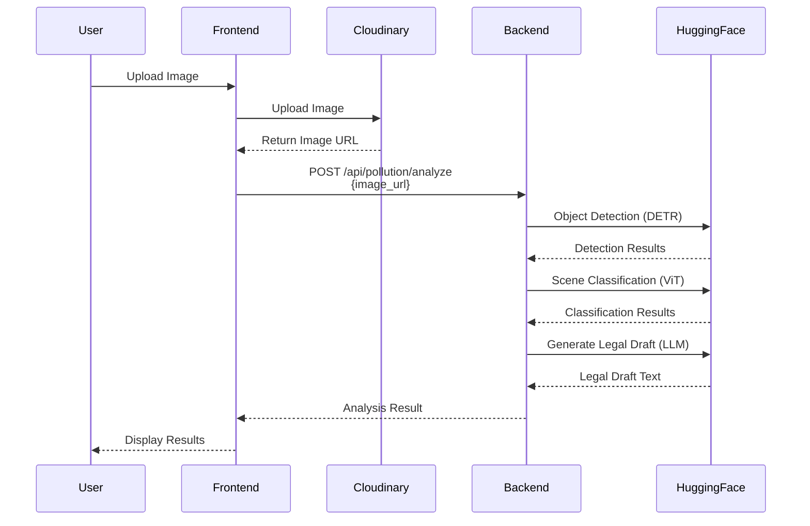
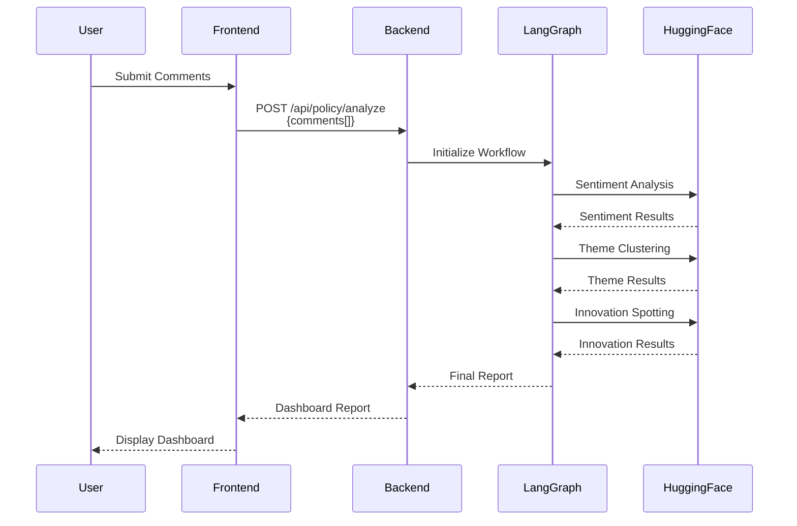

# PolluFight System Architecture Diagram

## Current Architecture (Before Consolidation)

```mermaid
graph TB
    subgraph "Client Layer"
        WEB[Web Browser / Tauri App]
        MOBILE[Android/iOS App]
    end

    subgraph "Frontend Application"
        REACT[React + TypeScript<br/>Vite Build]
        COMP[Components:<br/>- AI Lens<br/>- Pulse Dashboard<br/>- Guilty Map<br/>- Eco Wallet<br/>- Alert Feed]
    end

    subgraph "Backend Services - CURRENT"
        BE1[Backend #1: Pollution Detector<br/>FastAPI Server<br/>Port: 8000<br/>Location: pollution_detector/]
        BE2[Backend #2: Policy Feedback<br/>FastAPI Server<br/>Port: 8001<br/>Location: policy_feedback/]
    end

    subgraph "AI/ML Services"
        HF_API[Hugging Face API<br/>Router Endpoint]
        DETR[DETR Model<br/>Object Detection]
        VIT[ViT Model<br/>Scene Classification]
        LLAMA[Llama LLM<br/>Text Generation]
    end

    subgraph "External Services"
        CLOUDINARY[Cloudinary<br/>Image Storage & CDN]
        FIREBASE[Firebase Firestore<br/>NoSQL Database]
    end

    WEB --> REACT
    MOBILE --> REACT
    REACT --> COMP

    COMP -->|POST /analyze<br/>image_url| BE1
    COMP -->|POST /analyze<br/>comments[]| BE2
    COMP -->|Upload Images| CLOUDINARY
    COMP -->|Read/Write Data| FIREBASE

    BE1 -->|Object Detection Request| HF_API
    BE1 -->|Scene Classification| HF_API
    BE1 -->|Legal Draft Generation| HF_API
    
    BE2 -->|LangGraph Workflow| HF_API
    BE2 -->|Sentiment Analysis| HF_API
    BE2 -->|Theme Clustering| HF_API
    BE2 -->|Innovation Detection| HF_API

    HF_API --> DETR
    HF_API --> VIT
    HF_API --> LLAMA

    style BE1 fill:#ff6b6b,stroke:#c92a2a,stroke-width:3px
    style BE2 fill:#4dabf7,stroke:#1971c2,stroke-width:3px
    style HF_API fill:#ffd43b,stroke:#f59f00,stroke-width:2px
    style CLOUDINARY fill:#51cf66,stroke:#2f9e44,stroke-width:2px
    style FIREBASE fill:#ae3ec9,stroke:#862e9c,stroke-width:2px
```

## Proposed Unified Architecture (After Consolidation)

```mermaid
graph TB
    subgraph "Client Layer"
        WEB[Web Browser / Tauri App]
        MOBILE[Android/iOS App]
    end

    subgraph "Frontend Application"
        REACT[React + TypeScript<br/>Vite Build]
        COMP[Components:<br/>- AI Lens<br/>- Pulse Dashboard<br/>- Guilty Map<br/>- Eco Wallet<br/>- Alert Feed]
    end

    subgraph "Unified Backend Service - PROPOSED"
        UNIFIED[Unified FastAPI Server<br/>Port: 8000<br/>Location: unified_backend/]
        
        subgraph "API Routes"
            POLL_ROUTE[/api/pollution/analyze]
            POLICY_ROUTE[/api/policy/analyze]
            HEALTH_ROUTE[/health]
        end
        
        subgraph "Shared Services"
            AI_SVC[AI Service<br/>Hugging Face Client]
            CONFIG[Config Manager]
            MIDDLEWARE[CORS & Middleware]
        end
    end

    subgraph "AI/ML Services"
        HF_API[Hugging Face API<br/>Router Endpoint]
        DETR[DETR Model<br/>Object Detection]
        VIT[ViT Model<br/>Scene Classification]
        LLAMA[Llama LLM<br/>Text Generation]
    end

    subgraph "External Services"
        CLOUDINARY[Cloudinary<br/>Image Storage & CDN]
        FIREBASE[Firebase Firestore<br/>NoSQL Database]
    end

    WEB --> REACT
    MOBILE --> REACT
    REACT --> COMP

    COMP -->|POST /api/pollution/analyze| POLL_ROUTE
    COMP -->|POST /api/policy/analyze| POLICY_ROUTE
    COMP -->|Upload Images| CLOUDINARY
    COMP -->|Read/Write Data| FIREBASE

    POLL_ROUTE --> AI_SVC
    POLICY_ROUTE --> AI_SVC
    
    AI_SVC -->|Object Detection| HF_API
    AI_SVC -->|Scene Classification| HF_API
    AI_SVC -->|Text Generation| HF_API

    HF_API --> DETR
    HF_API --> VIT
    HF_API --> LLAMA

    UNIFIED --> POLL_ROUTE
    UNIFIED --> POLICY_ROUTE
    UNIFIED --> HEALTH_ROUTE
    UNIFIED --> AI_SVC
    UNIFIED --> CONFIG
    UNIFIED --> MIDDLEWARE

    style UNIFIED fill:#51cf66,stroke:#2f9e44,stroke-width:4px
    style POLL_ROUTE fill:#ffd43b,stroke:#f59f00,stroke-width:2px
    style POLICY_ROUTE fill:#ffd43b,stroke:#f59f00,stroke-width:2px
    style AI_SVC fill:#ff8787,stroke:#c92a2a,stroke-width:2px
    style HF_API fill:#ffd43b,stroke:#f59f00,stroke-width:2px
    style CLOUDINARY fill:#51cf66,stroke:#2f9e44,stroke-width:2px
    style FIREBASE fill:#ae3ec9,stroke:#862e9c,stroke-width:2px
```

## Data Flow Diagrams

### Pollution Detection Flow



### Policy Feedback Flow



## Backend Comparison

| Aspect | Current (2 Backends) | Proposed (Unified) |
|--------|---------------------|-------------------|
| **Number of Processes** | 2 | 1 |
| **Ports Required** | 8000, 8001 | 8000 |
| **Memory Usage** | ~2x Base | ~1x Base |
| **Deployment Complexity** | High | Low |
| **Code Duplication** | High | Low |
| **Configuration Management** | Separate | Unified |
| **Error Handling** | Duplicated | Centralized |
| **CORS Setup** | Duplicated | Single |
| **API Consistency** | Different | Unified |
| **Testing** | Separate | Integrated |
| **Scaling** | Independent | Unified |

## Key Statistics

- **Current Backends**: 2 separate FastAPI servers
- **External Services**: 3 (Hugging Face, Cloudinary, Firebase)
- **API Endpoints**: 4 total (2 per backend)
- **Ports in Use**: 2 (8000, 8001)
- **Shared Dependencies**: Hugging Face API (used by both)
- **Code Duplication**: ~40% (CORS, error handling, config)

## Consolidation Benefits

1. **Reduced Complexity**: Single backend to manage, deploy, and monitor
2. **Resource Efficiency**: ~30-40% reduction in memory and CPU usage
3. **Easier Maintenance**: One codebase to update and test
4. **Better Code Reuse**: Shared services and utilities
5. **Unified Configuration**: Single source of truth for settings
6. **Simplified Deployment**: One process, one port, one configuration
7. **Improved Testing**: Single test suite covering all endpoints
8. **Better Error Handling**: Centralized error management
9. **Consistent API**: Unified response formats and error codes
10. **Easier Scaling**: Scale one service instead of two
